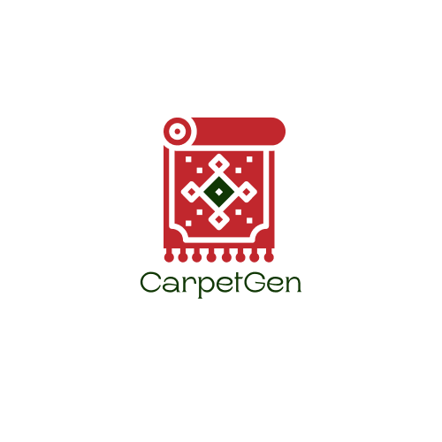
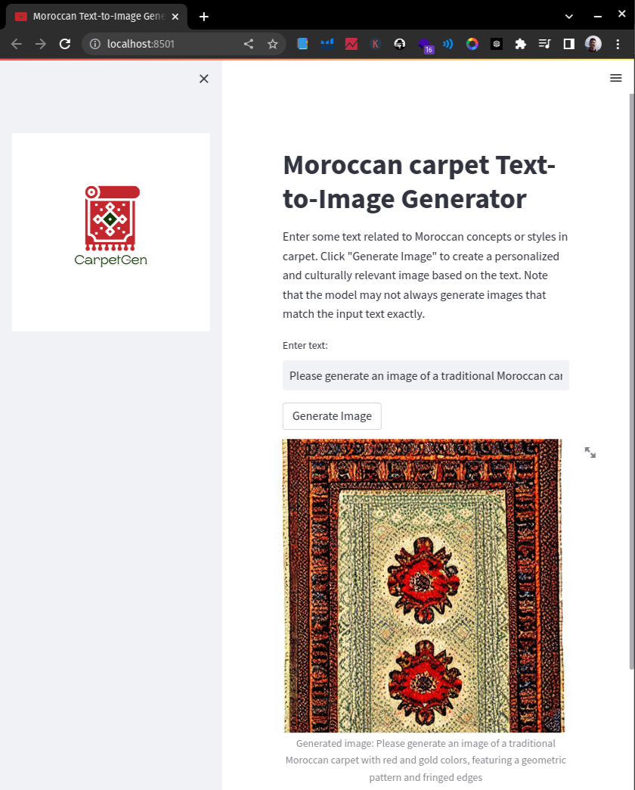

<h1 align="center" width="100%">
CarpetGen
</h1>

    

This is a text-to-image generator for traditional Moroccan carpets. The model is fine-tuned using textual-inversion fine-tuning for stable diffusion using diffusers. We use a pretrained model called runwayml/stable-diffusion-v1-5.

The goal of this project is to train a text-to-image generation model on Moroccan concepts or styles that can be applied in various creative fields. The model is capable of producing personalized and culturally relevant images based on the input text.

## Getting Started

To use the text-to-image generator, you will need to follow these steps:

1. Clone the repository to your local machine using git clone [git@github.com:hamzalimouri/carpetgen.git](https://github.com/hamzalimouri/carpetgen.git)
2. Install the required dependencies using pip: pip install -r requirements.txt
3. Download the [Model](https://drive.google.com/drive/folders/1U4edF_b8BEFJqHuhohl0xrV1kDquDrRj?usp=share_link)
4. Run the web user interface using the command 'streamlit run webui.py' in your terminal
5. Enter a text description of the type of Moroccan carpet you would like to generate into the input field on the web user interface
6. Click the "Generate Image" button to generate an image based on the input

## Technology

We used the following technologies for this project:

* Diffusers for fine-tuning the model
* Streamlit for the web user interface
* BeautifulSoup4 for scraping data
* Colab and VSCode for development and experimentation

## Data Collection

We collected data for the fine-tuning process from Etsy using web scraping techniques. We focused on traditional Moroccan carpets and gathered images and corresponding text descriptions. We used BeautifulSoup, a Python library, to scrape data from Etsy. 

## Fine-Tuning

We used Textual-inversion fine-tuning for Stable Diffusion using diffusers. This allowed us to fine-tune the pre-trained model to generate Moroccan carpet images based on user input. Specifically, we used the stable-diffusion-v1-5 pre-trained model from RunwayML.

## Model Evaluation

We evaluated the model by generating images based on a variety of input descriptions of Moroccan carpets. We also compared the generated images to actual photos of Moroccan carpets to ensure that they matched the style and color of traditional Moroccan carpets. We found that the model generated high-quality images that closely resembled traditional Moroccan carpets.

## Web User Interface

We developed a web user interface for the text-to-image generator using Streamlit. The user interface is intuitive and easy to use, and allows users to generate Moroccan carpet images based on text input. The interface is designed to be responsive and user-friendly, with clear instructions and a simple layout.

    

## Challenges

During the development of this project, we encountered several challenges, including:

* Deciding on the best method and algorithm for fine-tuning the model
* Dealing with GPU problems during training
* Navigating the complexities of fine-tuning a text-to-image generator for the first time

## Future Work

In the future, we plan to expand the generator to include other Moroccan cultural concepts and styles, such as Moroccan architecture and fashion. We also plan to explore other text-to-image generation technologies and fine-tuning methods to improve the quality of the generated images.

## Credits

This project was developed by BG team as part of the ThinkAI hackathon, organized by 1337 school. We would like to thank the organizers and mentors for their support and guidance. We would also like to acknowledge the contributions of the open-source community, including the developers of Difussers, Streamlit, and other libraries used in this project.
